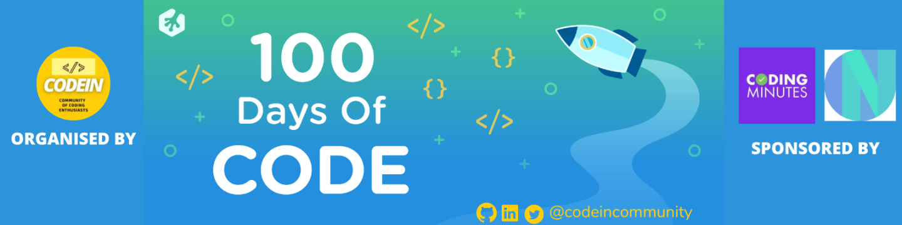

# 100 Days of Coding Challenge

## 100 Days of Code Program by [CodeIN Community](https://www.linkedin.com/company/codein-community), Supported by [Coding Minutes](https://www.linkedin.com/company/codingminutes/).

# Reports

| Day | Date | Problem Name | Platform | Code(Solution) | Social Media |GitHub |
| :---: |:---: | :---: | :---: | :---: | :---: | :---: |
| 01 | July 01, 2022 | [The Cheaper Cab](https://www.codechef.com/problems/CABS) | [CodeChef](https://www.codechef.com/) | [JAVA](https://www.codechef.com/viewsolution/68019123) | [LinkedIn](https://www.linkedin.com/posts/alaminkarno_100daysofcodechallenge-codeincommunity-codein100daysofcode-activity-6948556016548462592-HIjp?utm_source=linkedin_share&utm_medium=member_desktop_web) , [Twitter](https://twitter.com/alamin_karno/status/1542792099984461824?s=20&t=61YYJnJqAbyIzc8Rl77MeQ) | [Link](https://github.com/alamin-karno/100__day_of_coding_challange/tree/master/codes/Day%2001) |
| 02 | July 02, 2022 | [Volume Control](https://www.codechef.com/problems/VOLCONTROL) | [CodeChef](https://www.codechef.com/) | [JAVA](https://www.codechef.com/viewsolution/68049595) | [LinkedIn](https://www.linkedin.com/posts/alaminkarno_100daysofcodechallenge-codeincommunity-codein100daysofcode-activity-6948870584306925568-l3Aq?utm_source=linkedin_share&utm_medium=member_desktop_web) , [Twitter](https://twitter.com/alamin_karno/status/1543105485133721601?s=20&t=uefQ9U8s21_NDuNIfQ7-jw) | [Link](https://github.com/alamin-karno/100__day_of_coding_challange/tree/master/codes/Day%2002) |
| 03 | July 03, 2022 | [Enormous Input Test](https://www.codechef.com/problems/INTEST) | [CodeChef](https://www.codechef.com/) | [JAVA](https://www.codechef.com/viewsolution/68092597) | [LinkedIn](https://www.linkedin.com/posts/alaminkarno_100daysofcodechallenge-codeincommunity-codein100daysofcode-activity-6949259397348896768-OKdp?utm_source=linkedin_share&utm_medium=member_desktop_web) , [Twitter](https://twitter.com/alamin_karno/status/1543494137986826241?s=20&t=62NQCRjuMbY6Zq5iRI7qRQ) | [Link](https://github.com/alamin-karno/100__day_of_coding_challange/tree/master/codes/Day%2003) |
| 04 | July 04, 2022 | [Biryani classes](https://www.codechef.com/problems/BIRYANI) | [CodeChef](https://www.codechef.com/) | [JAVA](https://www.codechef.com/viewsolution/68191565) | [LinkedIn](https://www.linkedin.com/posts/alaminkarno_100daysofcodechallenge-codeincommunity-codein100daysofcode-activity-6949562225984425984-gFOg?utm_source=linkedin_share&utm_medium=member_desktop_web) , [Twitter](https://twitter.com/alamin_karno/status/1543797457343377408?s=20&t=Z1WCTWtUk4voV7YRCEjnzw) | [Link](https://github.com/alamin-karno/100__day_of_coding_challange/tree/master/codes/Day%2004) |
| 05 | July 05, 2022 | [Enough Space](https://www.codechef.com/problems/ENSPACE) | [CodeChef](https://www.codechef.com/) | [JAVA](https://www.codechef.com/viewsolution/68235844) | [LinkedIn](https://www.linkedin.com/posts/alaminkarno_100daysofcodechallenge-codeincommunity-codein100daysofcode-activity-6949921205986418688-un5b?utm_source=linkedin_share&utm_medium=member_desktop_web) , [Twitter](https://twitter.com/alamin_karno/status/1544157716465483777?s=20&t=LeWQZm9i-LUTguhq9Cjtxg) | [Link](https://github.com/alamin-karno/100__day_of_coding_challange/tree/master/codes/Day%2005) |
| 06 | July 06, 2022 | [Chef Drinks Tea](https://www.codechef.com/problems/TEA) | [CodeChef](https://www.codechef.com/) | [JAVA](https://www.codechef.com/viewsolution/68277579) | [LinkedIn](https://www.linkedin.com/posts/alaminkarno_100daysofcodechallenge-codeincommunity-codein100daysofcode-activity-6950283728250122240-d3Vh?utm_source=linkedin_share&utm_medium=member_desktop_web) , [Twitter](https://twitter.com/alamin_karno/status/1544518730776182786?s=20&t=cou8fLHt9fRcxO9yZMNNBw) | [Link](https://github.com/alamin-karno/100__day_of_coding_challange/tree/master/codes/Day%2006) |
| 07 | July 07, 2022 | [Counting Words](https://www.codechef.com/problems/CNTWRD) | [CodeChef](https://www.codechef.com/) | [JAVA](https://www.codechef.com/viewsolution/68457709) | [LinkedIn](https://www.linkedin.com/posts/alaminkarno_100daysofcodechallenge-codeincommunity-codein100daysofcode-activity-6950848456156397568-j_PM?utm_source=linkedin_share&utm_medium=member_desktop_web) , [Twitter](https://twitter.com/alamin_karno/status/1545083391925579777?s=20&t=3h-LmXzbJ_ODFOIeWnpq4w) | [Link](https://github.com/alamin-karno/100__day_of_coding_challange/tree/master/codes/Day%2007) |
| 08 | July 08, 2022 | [Roller Coaster](https://www.codechef.com/problems/MINHEIGHT) | [CodeChef](https://www.codechef.com/) | [JAVA](https://www.codechef.com/viewsolution/68542234) | [LinkedIn](https://www.linkedin.com/posts/alaminkarno_100daysofcodechallenge-codeincommunity-codein100daysofcode-activity-6951232828659367936-L-Xs?utm_source=linkedin_share&utm_medium=member_desktop_web) , [Twitter](https://twitter.com/alamin_karno/status/1545468974414327810?s=20&t=Vcctr4sfbbvFHWG2tziYBQ) | [Link](https://github.com/alamin-karno/100__day_of_coding_challange/tree/master/codes/Day%2008) |
| 09 | July 09, 2022 | [MATH1 Enrolmen](https://www.codechef.com/problems/M1ENROL) | [CodeChef](https://www.codechef.com/) | [JAVA](https://www.codechef.com/viewsolution/68563514) | [LinkedIn](https://www.linkedin.com/posts/alaminkarno_100daysofcodechallenge-codeincommunity-codein100daysofcode-activity-6951406919618039808-JK99?utm_source=linkedin_share&utm_medium=member_desktop_web) , [Twitter](https://twitter.com/alamin_karno/status/1545641964133306368?s=20&t=aVhue-LLN_tGykeeoVBBbw) | [Link](https://github.com/alamin-karno/100__day_of_coding_challange/tree/master/codes/Day%2009) |
| 10 | July 10, 2022 | [Chef and Brain Speed](https://www.codechef.com/problems/CBSPEED) | [CodeChef](https://www.codechef.com/) | [JAVA](https://www.codechef.com/viewsolution/68676105) | [LinkedIn](https://www.linkedin.com/posts/alaminkarno_100daysofcodechallenge-codeincommunity-codein100daysofcode-activity-6951894040166420480-Zijd?utm_source=linkedin_share&utm_medium=member_desktop_web) , [Twitter](https://twitter.com/alamin_karno/status/1546129001428975616?s=20&t=z30EMdIiug_ZHTjiShPdig) | [Link](https://github.com/alamin-karno/100__day_of_coding_challange/tree/master/codes/Day%2010) |
| 11 | July 11, 2022 | [Total Prize Money](https://www.codechef.com/problems/PRIZEPOOL) | [CodeChef](https://www.codechef.com/) | [JAVA](https://www.codechef.com/viewsolution/68713502) | [LinkedIn](https://www.linkedin.com/posts/alaminkarno_100daysofcodechallenge-codeincommunity-codein100daysofcode-activity-6952126243878109186-mjqh?utm_source=linkedin_share&utm_medium=member_desktop_web) , [Twitter](https://twitter.com/alamin_karno/status/1546361056590954497?s=20&t=ksnzvnVmBjxjn3HfD_DcqA) | [Link](https://github.com/alamin-karno/100__day_of_coding_challange/tree/master/codes/Day%2011) |
| 12 | July 12, 2022 | [Bidding](https://www.codechef.com/problems/AUCTION) | [CodeChef](https://www.codechef.com/) | [JAVA](https://www.codechef.com/viewsolution/68792163) | [LinkedIn](https://www.linkedin.com/posts/alaminkarno_100daysofcodechallenge-codeincommunity-codein100daysofcode-activity-6952601797345648640-kHHW?utm_source=linkedin_share&utm_medium=member_desktop_web) , [Twitter](https://twitter.com/alamin_karno/status/1546836519700561921?s=20&t=ZxTolyGkmgHiIrWQ7lDBGQ) | [Link](https://github.com/alamin-karno/100__day_of_coding_challange/tree/master/codes/Day%2012) |
| 13 | July 13, 2022 | [Pass the Exam](https://www.codechef.com/problems/PASSTHEEXAM) | [CodeChef](https://www.codechef.com/) | [JAVA](https://www.codechef.com/viewsolution/68953220) | [LinkedIn](https://www.linkedin.com/posts/alaminkarno_100daysofcodechallenge-codeincommunity-codein100daysofcode-activity-6953024785597554688-xF7V?utm_source=linkedin_share&utm_medium=member_desktop_web) , [Twitter](https://twitter.com/alamin_karno/status/1547260248519757824?s=20&t=5qM3YdFcSq8Q0JkE5yyJkA) | [Link](https://github.com/alamin-karno/100__day_of_coding_challange/tree/master/codes/Day%2013) |
| 14 | July 14, 2022 | [Chef On Date](https://www.codechef.com/problems/CHEFONDATE) | [CodeChef](https://www.codechef.com/) | [JAVA](https://www.codechef.com/viewsolution/69030943) | [LinkedIn](https://www.linkedin.com/posts/alaminkarno_100daysofcodechallenge-codeincommunity-codein100daysofcode-activity-6953395608393039872-APR-?utm_source=linkedin_share&utm_medium=member_desktop_web) , [Twitter](https://twitter.com/alamin_karno/status/1547630614593290240?s=20&t=XmRFVXOcCasG-o5cN1ZVrw) | [Link](https://github.com/alamin-karno/100__day_of_coding_challange/tree/master/codes/Day%2014) |
| 15 | July 15, 2022 | [Chess Time](https://www.codechef.com/problems/CHESSTIME) | [CodeChef](https://www.codechef.com/) | [JAVA](https://www.codechef.com/viewsolution/69056587) | [LinkedIn](https://www.linkedin.com/posts/alaminkarno_100daysofcodechallenge-codeincommunity-codein100daysofcode-activity-6953660474827714560-tZJU?utm_source=linkedin_share&utm_medium=member_desktop_web) , [Twitter](https://twitter.com/Yk404Gaming/status/1547827869426282498?s=20&t=Ymu4LKldv5PFz39DpnIE8g) | [Link](https://github.com/alamin-karno/100__day_of_coding_challange/tree/master/codes/Day%2015) |
| 16 | July 16, 2022 | [Minimum Coins](https://www.codechef.com/problems/MINCOINSREQ) | [CodeChef](https://www.codechef.com/) | [JAVA](https://www.codechef.com/viewsolution/69084601) | [LinkedIn](https://www.linkedin.com/posts/alaminkarno_100daysofcodechallenge-codeincommunity-codein100daysofcode-activity-6953912852646686720-29ZL?utm_source=linkedin_share&utm_medium=member_desktop_web) , [Twitter](https://twitter.com/alamin_karno/status/1548147719117873152?s=20&t=EYDclidbWLysTaTwLSHh8g) | [Link](https://github.com/alamin-karno/100__day_of_coding_challange/tree/master/codes/Day%2016) |
| 17 | July 17, 2022 | [Chef and Candies](https://www.codechef.com/problems/CHEFCAND) | [CodeChef](https://www.codechef.com/) | [JAVA](https://www.codechef.com/viewsolution/69125528) | [LinkedIn](https://www.linkedin.com/posts/alaminkarno_100daysofcodechallenge-codeincommunity-codein100daysofcode-activity-6954273448978235392-lYXx?utm_source=linkedin_share&utm_medium=member_desktop_web) , [Twitter](https://twitter.com/alamin_karno/status/1548508244427296768?s=20&t=fN_xHiM0dI1fAt_VYNE-jg) | [Link](https://github.com/alamin-karno/100__day_of_coding_challange/tree/master/codes/Day%2017) |
| 18 | July 18, 2022 | [Interior Design](https://www.codechef.com/problems/INTRDSGN) | [CodeChef](https://www.codechef.com/) | [JAVA](https://www.codechef.com/viewsolution/69265464) | [LinkedIn](https://www.linkedin.com/posts/alaminkarno_100daysofcodechallenge-codeincommunity-codein100daysofcode-activity-6954634871289905152-eUjj?utm_source=linkedin_share&utm_medium=member_desktop_web) , [Twitter](https://twitter.com/alamin_karno/status/1548869678487175168?s=20&t=U0cvggTvkpXylgzHVLYqjw) | [Link](https://github.com/alamin-karno/100__day_of_coding_challange/tree/master/codes/Day%2018) |
| 19 | July 19, 2022 | [True and False Paper](https://www.codechef.com/problems/TFPAPER) | [CodeChef](https://www.codechef.com/) | [JAVA](https://www.codechef.com/viewsolution/69311470) | [LinkedIn](https://www.linkedin.com/posts/alaminkarno_100daysofcodechallenge-codeincommunity-codein100daysofcode-activity-6954998787811540993-FZ98?utm_source=linkedin_share&utm_medium=member_desktop_web) , [Twitter](https://twitter.com/alamin_karno/status/1549233525647605761?s=20&t=lRzTqOlYI04gLT6AdNj-dA) | [Link](https://github.com/alamin-karno/100__day_of_coding_challange/tree/master/codes/Day%2019) |
| 20 | July 20, 2022 | [The Last Levels](https://www.codechef.com/problems/LASTLEVELS) | [CodeChef](https://www.codechef.com/) | [JAVA](https://www.codechef.com/viewsolution/69353803) | [LinkedIn](https://www.linkedin.com/posts/alaminkarno_100daysofcodechallenge-codeincommunity-codein100daysofcode-activity-6955363654384979968-P8Wz?utm_source=linkedin_share&utm_medium=member_desktop_web) , [Twitter](https://twitter.com/alamin_karno/status/1549598422277423104?s=20&t=aGxpx78B9sAObG8CpOIcbw) | [Link](https://github.com/alamin-karno/100__day_of_coding_challange/tree/master/codes/Day%2020) |
| 21 | July 21, 2022 | [Passes for Fair](https://www.codechef.com/problems/FAIRPASS) | [CodeChef](https://www.codechef.com/) | [JAVA](https://www.codechef.com/viewsolution/69502833) | [LinkedIn](https://www.linkedin.com/posts/alaminkarno_100daysofcodechallenge-codeincommunity-codein100daysofcode-activity-6955717458871664641-QTik?utm_source=linkedin_share&utm_medium=member_desktop_web) , [Twitter](https://twitter.com/alamin_karno/status/1549955158440038402?s=20&t=k7MZwLytYw-AV3vLVaoE9w) | [Link](https://github.com/alamin-karno/100__day_of_coding_challange/tree/master/codes/Day%2021) |
| 22 | July 22, 2022 | [Second Max of Three Numbers](https://www.codechef.com/problems/SNDMAX) | [CodeChef](https://www.codechef.com/) | [JAVA](https://www.codechef.com/viewsolution/69628659) | [LinkedIn](https://www.linkedin.com/posts/alaminkarno_100daysofcodechallenge-codeincommunity-codein100daysofcode-activity-6956286995492990976-vyiu?utm_source=linkedin_share&utm_medium=member_desktop_web) , [Twitter](https://twitter.com/alamin_karno/status/1550522038607282176?s=20&t=Xb2DNcKOjUElOMXAgQUnQA) | [Link](https://github.com/alamin-karno/100__day_of_coding_challange/tree/master/codes/Day%2022) |
| 23 | July 23, 2022 | [Fill Candies](https://www.codechef.com/problems/FILLCANDIES) | [CodeChef](https://www.codechef.com/) | [JAVA](https://www.codechef.com/viewsolution/69662474) | [LinkedIn](https://www.linkedin.com/posts/alaminkarno_100daysofcodechallenge-codeincommunity-codein100daysofcode-activity-6956453252162875392-EoJV?utm_source=linkedin_share&utm_medium=member_desktop_web) , [Twitter](https://twitter.com/alamin_karno/status/1550688164884652032?s=20&t=PzW1kPfq5m5o-AwVjDnZmw) | [Link](https://github.com/alamin-karno/100__day_of_coding_challange/tree/master/codes/Day%2023) |
| 24 | July 24, 2022 | [Buy Lamps](https://www.codechef.com/problems/BUYLAMP) | [CodeChef](https://www.codechef.com/) | [JAVA](https://www.codechef.com/viewsolution/69764704) | [LinkedIn](https://www.linkedin.com/posts/alaminkarno_100daysofcodechallenge-codeincommunity-codein100daysofcode-activity-6956806206648721408-kiS2?utm_source=linkedin_share&utm_medium=member_desktop_web) , [Twitter](https://twitter.com/alamin_karno/status/1551041091469996033?s=20&t=cs0uym6vammdfjtPU10hgQ) | [Link](https://github.com/alamin-karno/100__day_of_coding_challange/tree/master/codes/Day%2024) |
| 25 | July 25, 2022 | [Chairs Requirement](https://www.codechef.com/problems/CHAIRS_) | [CodeChef](https://www.codechef.com/) | [JAVA](https://www.codechef.com/viewsolution/69853420) | [LinkedIn](https://www.linkedin.com/posts/alaminkarno_100daysofcodechallenge-codeincommunity-codein100daysofcode-activity-6957164266676256768-EsAd?utm_source=linkedin_share&utm_medium=member_desktop_web) , [Twitter](https://twitter.com/alamin_karno/status/1551399309031411712?s=20&t=fXQvjwz4loBfsasCelu2WQ) | [Link](https://github.com/alamin-karno/100__day_of_coding_challange/tree/master/codes/Day%2025) |
| 26 | July 26, 2022 | [Insurance](https://www.codechef.com/problems/INSURANCE) | [CodeChef](https://www.codechef.com/) | [JAVA](https://www.codechef.com/viewsolution/69917017) | [LinkedIn](https://www.linkedin.com/posts/alaminkarno_100daysofcodechallenge-codeincommunity-codein100daysofcode-activity-6957528414866026496-4zAN?utm_source=linkedin_share&utm_medium=member_desktop_web) , [Twitter](https://twitter.com/alamin_karno/status/1551763273883975680?s=20&t=UrfoS5uD8K8fwnf6-8i-Tg) | [Link](https://github.com/alamin-karno/100__day_of_coding_challange/tree/master/codes/Day%2026) |
| 27 | July 27, 2022 | [Chef in his Office](https://www.codechef.com/problems/OFFICE) | [CodeChef](https://www.codechef.com/) | [JAVA](https://www.codechef.com/viewsolution/69965919) | [LinkedIn](https://www.linkedin.com/posts/alaminkarno_100daysofcodechallenge-codeincommunity-codein100daysofcode-activity-6957886904713261056-5R-5?utm_source=linkedin_share&utm_medium=member_desktop_web) , [Twitter](https://twitter.com/alamin_karno/status/1552121669783007232?s=20&t=3PyM36BmxHUFNPF-kChhOQ) | [Link](https://github.com/alamin-karno/100__day_of_coding_challange/tree/master/codes/Day%2027) |
| 28 | July 28, 2022 | [Is it hot or cold](https://www.codechef.com/problems/HOTCOLD) | [CodeChef](https://www.codechef.com/) | [JAVA](https://www.codechef.com/viewsolution/70144391) | [LinkedIn](https://www.linkedin.com/posts/alaminkarno_100daysofcodechallenge-codeincommunity-codein100daysofcode-activity-6958255239300861952-dHvh?utm_source=linkedin_share&utm_medium=member_desktop_web) , [Twitter](https://twitter.com/alamin_karno/status/1552490010594930688?s=20&t=XP9Ere8SRf42mDg6t3i1Cw) | [Link](https://github.com/alamin-karno/100__day_of_coding_challange/tree/master/codes/Day%2028) |
| 29 | July 29, 2022 | [Maximise the Tastiness](https://www.codechef.com/problems/MAXTASTE) | [CodeChef](https://www.codechef.com/) | [JAVA](https://www.codechef.com/viewsolution/70218874) | [LinkedIn](https://www.linkedin.com/posts/alaminkarno_100daysofcodechallenge-codeincommunity-codein100daysofcode-activity-6958712392339927040-WozC?utm_source=linkedin_share&utm_medium=member_desktop_web) , [Twitter](https://twitter.com/alamin_karno/status/1552947178532110336?s=20&t=pe6RPDmlS03cNXjOfiRwwQ) | [Link](https://github.com/alamin-karno/100__day_of_coding_challange/tree/master/codes/Day%2029) |
| 30 | July 30, 2022 | [Get a Subscription](https://www.codechef.com/problems/SUBSCRIBE) | [CodeChef](https://www.codechef.com/) | [JAVA](https://www.codechef.com/viewsolution/70283529) | [LinkedIn](https://www.linkedin.com/posts/alaminkarno_100daysofcodechallenge-codeincommunity-codein100daysofcode-activity-6959190915785658369-6jmr?utm_source=linkedin_share&utm_medium=member_desktop_web) , [Twitter](https://twitter.com/alamin_karno/status/1553425683413880832?s=20&t=t9TU6hCE_OsxIpzwN1cAow) | [Link](https://github.com/alamin-karno/100__day_of_coding_challange/tree/master/codes/Day%2030) |
| 31 | July 31, 2022 | [Waiting Time](https://www.codechef.com/problems/WAITTIME) | [CodeChef](https://www.codechef.com/) | [JAVA](https://www.codechef.com/viewsolution/70297106) | [LinkedIn](https://www.linkedin.com/posts/alaminkarno_100daysofcodechallenge-codeincommunity-codein100daysofcode-activity-6959343777291395073-Jf5Q?utm_source=linkedin_share&utm_medium=member_desktop_web) , [Twitter](https://twitter.com/alamin_karno/status/1553579062190559232?s=20&t=9tKfgAT2nRPl9ML58pXhVw) | [Link](https://github.com/alamin-karno/100__day_of_coding_challange/tree/master/codes/Day%2031) |
| 32 | August 01, 2022 | [Equal Distribution](https://www.codechef.com/problems/EQUALDIST) | [CodeChef](https://www.codechef.com/) | [JAVA](https://www.codechef.com/viewsolution/70339186) | [LinkedIn](https://www.linkedin.com/posts/alaminkarno_100daysofcodechallenge-codeincommunity-codein100daysofcode-activity-6959700076701106176-kHQK?utm_source=linkedin_share&utm_medium=member_desktop_web) , [Twitter](https://twitter.com/alamin_karno/status/1553935355128483840?s=20&t=gcAonYUsN8lbM7D5MWD_7w) | [Link](https://github.com/alamin-karno/100__day_of_coding_challange/tree/master/codes/Day%2032) |
| 33 | August 02, 2022 | [Chef and Chapters](https://www.codechef.com/problems/SEMCOURSES) | [CodeChef](https://www.codechef.com/) | [JAVA](https://www.codechef.com/viewsolution/70382577) | [LinkedIn](https://www.linkedin.com/posts/alaminkarno_100daysofcodechallenge-codeincommunity-codein100daysofcode-activity-6960064858398625792-82CI?utm_source=linkedin_share&utm_medium=member_desktop_web) , [Twitter](https://twitter.com/alamin_karno/status/1554300053900369920?s=20&t=sloyuwaLBUGdoDxeLm_rew) | [Link](https://github.com/alamin-karno/100__day_of_coding_challange/tree/master/codes/Day%2033) |
| 34 | August 03, 2022 | [Water Requirement](https://www.codechef.com/problems/WATERREQ) | [CodeChef](https://www.codechef.com/) | [JAVA](https://www.codechef.com/viewsolution/70431020) | [LinkedIn](https://www.linkedin.com/posts/alaminkarno_100daysofcodechallenge-codeincommunity-codein100daysofcode-activity-6960433235549978624-Ay5j?utm_source=linkedin_share&utm_medium=member_desktop_web) , [Twitter](https://twitter.com/alamin_karno/status/1554668327989309440?s=20&t=EPekGMLwfxawAjBghDZm3w) | [Link](https://github.com/alamin-karno/100__day_of_coding_challange/tree/master/codes/Day%2034) |
| 35 | August 04, 2022 | [Discount](https://www.codechef.com/problems/DISCNT) | [CodeChef](https://www.codechef.com/) | [JAVA](https://www.codechef.com/viewsolution/70627974) | [LinkedIn](https://www.linkedin.com/posts/alaminkarno_100daysofcodechallenge-codeincommunity-codein100daysofcode-activity-6960800666944507904-fifx?utm_source=linkedin_share&utm_medium=member_desktop_web) , [Twitter](https://twitter.com/alamin_karno/status/1555035455225462785?s=20&t=uXMLsToqNK-gkziUoSXr7A) | [Link](https://github.com/alamin-karno/100__day_of_coding_challange/tree/master/codes/Day%2035) |
| 36 | August 05, 2022 | [Lunchtime](https://www.codechef.com/problems/LTIME) | [CodeChef](https://www.codechef.com/) | [JAVA](https://www.codechef.com/viewsolution/70717941) | [LinkedIn](https://www.linkedin.com/posts/alaminkarno_100daysofcodechallenge-codeincommunity-codein100daysofcode-activity-6961351609205350400-DfQG?utm_source=linkedin_share&utm_medium=member_desktop_web) , [Twitter](https://twitter.com/alamin_karno/status/1555586393048760320?s=20&t=jjFz_-KVBsjXbve3F87B3Q) | [Link](https://github.com/alamin-karno/100__day_of_coding_challange/tree/master/codes/Day%2036) |
| 37 | August 06, 2022 | [Apples and Oranges](https://www.codechef.com/problems/APPLORNG) | [CodeChef](https://www.codechef.com/) | [JAVA](https://www.codechef.com/viewsolution/70732148) | [LinkedIn](https://www.linkedin.com/posts/alaminkarno_100daysofcodechallenge-codeincommunity-codein100daysofcode-activity-6961523470593667072-uY_m?utm_source=linkedin_share&utm_medium=member_desktop_web) , [Twitter](https://twitter.com/alamin_karno/status/1555758242713980928?s=20&t=rTl82Y9ylANu0AXZbRAwnw) | [Link](https://github.com/alamin-karno/100__day_of_coding_challange/tree/master/codes/Day%2037) |
| 38 | August 07, 2022 | [Chef gives Party](https://www.codechef.com/problems/PARTY2) | [CodeChef](https://www.codechef.com/) | [JAVA](https://www.codechef.com/viewsolution/70779413) | [LinkedIn](https://www.linkedin.com/posts/alaminkarno_100daysofcodechallenge-codeincommunity-codein100daysofcode-activity-6961880114045345792-h0C8?utm_source=linkedin_share&utm_medium=member_desktop_web) , [Twitter](https://twitter.com/alamin_karno/status/1556115064075485193?s=20&t=K2gZDCnbMefhzA4Uic0fAA) | [Link](https://github.com/alamin-karno/100__day_of_coding_challange/tree/master/codes/Day%2038) |
| 39 | August 08, 2022 | [Air Hockey](https://www.codechef.com/problems/AIRHOCKEY) | [CodeChef](https://www.codechef.com/) | [JAVA](https://www.codechef.com/viewsolution/70823902) | [LinkedIn](https://www.linkedin.com/posts/alaminkarno_100daysofcodechallenge-codeincommunity-codein100daysofcode-activity-6962253070193893376-2JWj?utm_source=linkedin_share&utm_medium=member_desktop_web) , [Twitter](https://twitter.com/alamin_karno/status/1556487821514653696?s=20&t=7d8twA1OOiAHSGoUkdESiw) | [Link](https://github.com/alamin-karno/100__day_of_coding_challange/tree/master/codes/Day%2039) |
| 40 | August 09, 2022 | [Email Reminders](https://www.codechef.com/problems/EMAILREM) | [CodeChef](https://www.codechef.com/) | [JAVA](https://www.codechef.com/viewsolution/70877211) | [LinkedIn](https://www.linkedin.com/posts/alaminkarno_100daysofcodechallenge-codeincommunity-codein100daysofcode-activity-6962640862455500800-oayc?utm_source=linkedin_share&utm_medium=member_desktop_web) , [Twitter](https://twitter.com/alamin_karno/status/1556875554199982080?s=20&t=eGsgF94Ze12J7_W8U_lXTg) | [Link](https://github.com/alamin-karno/100__day_of_coding_challange/tree/master/codes/Day%2040) |
| 41 | August 10, 2022 | [Six Friends](https://www.codechef.com/problems/SIXFRIENDS) | [CodeChef](https://www.codechef.com/) | [JAVA](https://www.codechef.com/viewsolution/70922789) | [LinkedIn](https://www.linkedin.com/posts/alaminkarno_100daysofcodechallenge-codeincommunity-codein100daysofcode-activity-6962962197496942592-8qP_?utm_source=linkedin_share&utm_medium=member_desktop_web) , [Twitter](https://twitter.com/alamin_karno/status/1557197102824194049?s=20&t=ZRxvi4zBebvV2UZTDnD6fw) | [Link](https://github.com/alamin-karno/100__day_of_coding_challange/tree/master/codes/Day%2041) |
| 42 | August 11, 2022 | [Rating Improvement](https://www.codechef.com/problems/ADVANCE) | [CodeChef](https://www.codechef.com/) | [JAVA](https://www.codechef.com/viewsolution/71106554) | [LinkedIn](https://www.linkedin.com/posts/alaminkarno_100daysofcodechallenge-codeincommunity-codein100daysofcode-activity-6963333577048551425-RZ3a?utm_source=linkedin_share&utm_medium=member_desktop_web) , [Twitter](https://twitter.com/alamin_karno/status/1557568317929693184?s=20&t=HUl-9r0oedrxvYFdKbcu9g) | [Link](https://github.com/alamin-karno/100__day_of_coding_challange/tree/master/codes/Day%2042) |
| 43 | August 12, 2022 | [Chef and Chocolates](https://www.codechef.com/problems/CCHOCOLATES) | [CodeChef](https://www.codechef.com/) | [JAVA](https://www.codechef.com/viewsolution/71164325) | [LinkedIn](https://www.linkedin.com/posts/alaminkarno_100daysofcodechallenge-codeincommunity-codein100daysofcode-activity-6963775316796342272-B-qD?utm_source=linkedin_share&utm_medium=member_desktop_web) , [Twitter](https://twitter.com/alamin_karno/status/1558010241362857984?s=20&t=TJxhTIm3aMEcCn2XrAN06w) | [Link](https://github.com/alamin-karno/100__day_of_coding_challange/tree/master/codes/Day%2043) |
| 44 | August 13, 2022 | [Football Cup](https://www.codechef.com/problems/FOOTCUP) | [CodeChef](https://www.codechef.com/) | [JAVA](https://www.codechef.com/viewsolution/71331620) | [LinkedIn](https://www.linkedin.com/posts/alaminkarno_100daysofcodechallenge-codeincommunity-codein100daysofcode-activity-6964257199753744384-BXKL?utm_source=linkedin_share&utm_medium=member_desktop_web) , [Twitter](https://twitter.com/alamin_karno/status/1558492171862687745?s=20&t=IQF-m-FL5qmyDOF-4AxDlw) | [Link](https://github.com/alamin-karno/100__day_of_coding_challange/tree/master/codes/Day%2044) |
| 45 | August 14, 2022 | [Fill the Bucket](https://www.codechef.com/problems/FBC) | [CodeChef](https://www.codechef.com/) | [JAVA](https://www.codechef.com/viewsolution/71354102) | [LinkedIn](https://www.linkedin.com/posts/alaminkarno_100daysofcodechallenge-codeincommunity-codein100daysofcode-activity-6964417480958111744-IABR?utm_source=linkedin_share&utm_medium=member_desktop_web) , [Twitter](https://twitter.com/alamin_karno/status/1558652491323293699?s=20&t=kSzrkyVHBmmO8zzblQAAjA) | [Link](https://github.com/alamin-karno/100__day_of_coding_challange/tree/master/codes/Day%2045) |
| 46 | August 15, 2022 | [TV Discount](https://www.codechef.com/problems/TVDISC) | [CodeChef](https://www.codechef.com/) | [JAVA](https://www.codechef.com/viewsolution/71481262) | [LinkedIn](https://www.linkedin.com/posts/alaminkarno_100daysofcodechallenge-codeincommunity-codein100daysofcode-activity-6964928252565999616-ya_h?utm_source=linkedin_share&utm_medium=member_desktop_web) , [Twitter](https://twitter.com/alamin_karno/status/1559163030302511105?s=20&t=rVH8X25Q5s2u826Kc59WSw) | [Link](https://github.com/alamin-karno/100__day_of_coding_challange/tree/master/codes/Day%2046) |
| 47 | August 16, 2022 | [Maximum Submissions](https://www.codechef.com/problems/MAXIMUMSUBS) | [CodeChef](https://www.codechef.com/) | [JAVA](https://www.codechef.com/viewsolution/71502884) | [LinkedIn](https://www.linkedin.com/posts/alaminkarno_100daysofcodechallenge-codeincommunity-codein100daysofcode-activity-6965142507223441408-PI-T?utm_source=linkedin_share&utm_medium=member_desktop_web) , [Twitter](https://twitter.com/alamin_karno/status/1559377302512758785?s=20&t=g5ABnpBzhYX4rhe65xJYXg) | [Link](https://github.com/alamin-karno/100__day_of_coding_challange/tree/master/codes/Day%2047) |
| 48 | August 17, 2022 | [Final Population](https://www.codechef.com/problems/POPULATION) | [CodeChef](https://www.codechef.com/) | [JAVA](https://www.codechef.com/viewsolution/71552873) | [LinkedIn](https://www.linkedin.com/posts/alaminkarno_100daysofcodechallenge-codeincommunity-codein100daysofcode-activity-6965506968266387456-Rh8o?utm_source=linkedin_share&utm_medium=member_desktop_web) , [Twitter](https://twitter.com/alamin_karno/status/1559741802630230017?s=20&t=5h5Jr_Ajd6WuUfyRMeanjw) | [Link](https://github.com/alamin-karno/100__day_of_coding_challange/tree/master/codes/Day%2048) |
| 49 | August 18, 2022 | [Sale Season](https://www.codechef.com/problems/SALESEASON) | [CodeChef](https://www.codechef.com/) | [JAVA](https://www.codechef.com/viewsolution/71755601) | [LinkedIn](https://www.linkedin.com/posts/alaminkarno_100daysofcodechallenge-codeincommunity-codein100daysofcode-activity-6966016726329163776-hFbm?utm_source=linkedin_share&utm_medium=member_desktop_web) , [Twitter](https://twitter.com/alamin_karno/status/1560251590510264320?s=20&t=ORP6Mha3LYkt8vGCRxugTA) | [Link](https://github.com/alamin-karno/100__day_of_coding_challange/tree/master/codes/Day%2049) |
| 50 | August 19, 2022 | [Find Remainder](https://www.codechef.com/problems/FLOW002) | [CodeChef](https://www.codechef.com/) | [JAVA](https://www.codechef.com/viewsolution/71780557) | [LinkedIn](https://www.linkedin.com/posts/alaminkarno_100daysofcodechallenge-codeincommunity-codein100daysofcode-activity-6966217128576262145-LkLU?utm_source=linkedin_share&utm_medium=member_desktop_web) , [Twitter](https://twitter.com/alamin_karno/status/1560451911501123585?s=20&t=lnFJn9vpe_foOy-b-VbV8w) | [Link](https://github.com/alamin-karno/100__day_of_coding_challange/tree/master/codes/Day%2050) |
| 51| August 20, 2022 | [Chef and Masks](https://www.codechef.com/problems/CMASKS) | [CodeChef](https://www.codechef.com/) | [JAVA](https://www.codechef.com/viewsolution/71829269) | [LinkedIn](https://www.linkedin.com/posts/alaminkarno_100daysofcodechallenge-codeincommunity-codein100daysofcode-activity-6966601420913483776-Dr4D?utm_source=linkedin_share&utm_medium=member_desktop_web) , [Twitter](https://twitter.com/alamin_karno/status/1560836270246739968?s=20&t=0kl2u-mFPrCiDMODhd3CNQ) | [Link](https://github.com/alamin-karno/100__day_of_coding_challange/tree/master/codes/Day%2051) |
| 52| August 21, 2022 | [Expiring Bread](https://www.codechef.com/problems/EXPIRY) | [CodeChef](https://www.codechef.com/) | [JAVA](https://www.codechef.com/viewsolution/71875493) | [LinkedIn](https://www.linkedin.com/posts/alaminkarno_100daysofcodechallenge-codeincommunity-codein100daysofcode-activity-6966956816257753088-Nbti?utm_source=linkedin_share&utm_medium=member_desktop_web) , [Twitter](https://twitter.com/alamin_karno/status/1561191887683612672?s=20&t=n2RfkVKpjH1-wM5jwtMgtA) | [Link](https://github.com/alamin-karno/100__day_of_coding_challange/tree/master/codes/Day%2052) |
| 53| August 22, 2022 | [Tyre problem](https://www.codechef.com/problems/TYRE) | [CodeChef](https://www.codechef.com/) | [JAVA](https://www.codechef.com/viewsolution/71924493) | [LinkedIn](https://www.linkedin.com/posts/alaminkarno_100daysofcodechallenge-codeincommunity-codein100daysofcode-activity-6967361485287153664-I2-A?utm_source=linkedin_share&utm_medium=member_desktop_web) , [Twitter](https://twitter.com/alamin_karno/status/1561597830065967104?s=20&t=NQJ1OPhE3ZEWFHlWY8Icfg) | [Link](https://github.com/alamin-karno/100__day_of_coding_challange/tree/master/codes/Day%2053) |
| 54| August 23, 2022 | [Monthly Budget](https://www.codechef.com/problems/BUDGET_) | [CodeChef](https://www.codechef.com/) | [JAVA](https://www.codechef.com/viewsolution/72126292) | [LinkedIn](https://www.linkedin.com/posts/alaminkarno_100daysofcodechallenge-codeincommunity-codein100daysofcode-activity-6967361485287153664-I2-A?utm_source=share&utm_medium=member_desktop) , [Twitter](https://twitter.com/alamin_karno/status/1561973030947258368?s=20&t=b4hEhoB1-3kJ9f1-y0Ibaw) | [Link](https://github.com/alamin-karno/100__day_of_coding_challange/tree/master/codes/Day%2054) |
| 55| August 24, 2022 | [Chef and Instant Noodles](https://www.codechef.com/problems/INSTNOODLE) | [CodeChef](https://www.codechef.com/) | [JAVA](https://www.codechef.com/viewsolution/72197190) | [LinkedIn](https://www.linkedin.com/posts/alaminkarno_100daysofcodechallenge-codeincommunity-codein100daysofcode-activity-6968189160079712256-MmwE?utm_source=share&utm_medium=member_desktop) , [Twitter](https://twitter.com/alamin_karno/status/1562424179684954117?s=20&t=Dd4rfZjSz_VWidCW50-7EA) | [Link](https://github.com/alamin-karno/100__day_of_coding_challange/tree/master/codes/Day%2055) |
| 56| August 25, 2022 | [First and Last Digit](https://www.codechef.com/problems/FLOW004) | [CodeChef](https://www.codechef.com/) | [JAVA](https://www.codechef.com/viewsolution/72391574) | [LinkedIn](https://www.linkedin.com/posts/alaminkarno_100daysofcodechallenge-codeincommunity-codein100daysofcode-activity-6968407348906254336-K2Yr?utm_source=share&utm_medium=member_desktop) , [Twitter](https://twitter.com/alamin_karno/status/1562643036852879361?s=20&t=X8fNjzL0jX_maXJfaHdZOw) | [Link](https://github.com/alamin-karno/100__day_of_coding_challange/tree/master/codes/Day%2056) |
| 57| August 26, 2022 | [Practice makes us perfect](https://www.codechef.com/problems/PRACTICEPERF) | [CodeChef](https://www.codechef.com/) | [JAVA](https://www.codechef.com/viewsolution/72475156) | [LinkedIn](https://www.linkedin.com/posts/alaminkarno_100daysofcodechallenge-codeincommunity-codein100daysofcode-activity-6968901118772854784--uh6?utm_source=share&utm_medium=member_desktop) , [Twitter](https://twitter.com/alamin_karno/status/1563136123408621569?s=20&t=bjeBteWdaRFlBtouNayghw) | [Link](https://github.com/alamin-karno/100__day_of_coding_challange/tree/master/codes/Day%2057) |
| 58| August 27, 2022 | [The Mango Truck](https://www.codechef.com/problems/MANGOES) | [CodeChef](https://www.codechef.com/) | [JAVA](https://www.codechef.com/viewsolution/72520032) | [LinkedIn](https://www.linkedin.com/posts/alaminkarno_100daysofcodechallenge-codeincommunity-codein100daysofcode-activity-6969201995819737088-kE2r?utm_source=share&utm_medium=member_desktop) , [Twitter](https://twitter.com/alamin_karno/status/1563436789603643393?s=20&t=t3D9yOA2JlCVmSfQL4Yq7w) | [Link](https://github.com/alamin-karno/100__day_of_coding_challange/tree/master/codes/Day%2058) |
| 59| August 28, 2022 | [Bucket and Water Flow](https://www.codechef.com/problems/WATERFLOW) | [CodeChef](https://www.codechef.com/) | [JAVA](https://www.codechef.com/viewsolution/72559757) | [LinkedIn](https://www.linkedin.com/posts/alaminkarno_100daysofcodechallenge-codeincommunity-codein100daysofcode-activity-6969492234387828736-Q-2s?utm_source=share&utm_medium=member_desktop) , [Twitter](https://twitter.com/alamin_karno/status/1563727171998617600?s=20&t=X9clnGRgufVw8D_0OUqruQ) | [Link](https://github.com/alamin-karno/100__day_of_coding_challange/tree/master/codes/Day%2059) |
| 60| August 29, 2022 | [Miami GP](https://www.codechef.com/problems/F1RULE) | [CodeChef](https://www.codechef.com/) | [JAVA](https://www.codechef.com/viewsolution/72612409) | [LinkedIn](https://www.linkedin.com/posts/alaminkarno_100daysofcodechallenge-codeincommunity-codein100daysofcode-activity-6969895419401187328-1MBG?utm_source=share&utm_medium=member_desktop) , [Twitter](https://twitter.com/alamin_karno/status/1564130215651332096?s=20&t=qt4eNpYMC6ZU3ldzXwATNA) | [Link](https://github.com/alamin-karno/100__day_of_coding_challange/tree/master/codes/Day%2060) |
| 61| August 30, 2022 | [Dominant Army](https://www.codechef.com/problems/DOMINANT) | [CodeChef](https://www.codechef.com/) | [JAVA](https://www.codechef.com/viewsolution/72660201) | [LinkedIn](https://www.linkedin.com/posts/alaminkarno_100daysofcodechallenge-codeincommunity-codein100daysofcode-activity-6970220824649744384-9UWJ?utm_source=share&utm_medium=member_desktop) , [Twitter](https://twitter.com/alamin_karno/status/1564456123557892107?s=20&t=-iEQCNfrm_WmUaXvI1jRoA) | [Link](https://github.com/alamin-karno/100__day_of_coding_challange/tree/master/codes/Day%2061) |
| 62 | August 31, 2022 | [Playlist](https://www.codechef.com/problems/SONGS) | [CodeChef](https://www.codechef.com/) | [JAVA](https://www.codechef.com/viewsolution/72712512) | [LinkedIn](https://www.linkedin.com/posts/alaminkarno_100daysofcodechallenge-codeincommunity-codein100daysofcode-activity-6970573936149377024-Nw6a?utm_source=share&utm_medium=member_desktop) , [Twitter](https://twitter.com/alamin_karno/status/1564808745754185728?s=20&t=-pZDv3k2A5Vs8XkwnIqSbw) | [Link](https://github.com/alamin-karno/100__day_of_coding_challange/tree/master/codes/Day%2062) |
| 63 | September 1, 2022 | [Height of Rationals](https://www.codechef.com/problems/HEIGHTRATION) | [CodeChef](https://www.codechef.com/) | [JAVA](https://www.codechef.com/viewsolution/72868484) | [LinkedIn](https://www.linkedin.com/posts/alaminkarno_100daysofcodechallenge-codeincommunity-codein100daysofcode-activity-6970941176505925632-ij1W?utm_source=share&utm_medium=member_desktop) , [Twitter](https://twitter.com/alamin_karno/status/1565186547624083456?s=20&t=Gn9lfXbSvAuC9iF5YKQXSw) | [Link](https://github.com/alamin-karno/100__day_of_coding_challange/tree/master/codes/Day%2063) |
| 64 | September 2, 2022 | [Chef and Chocolates](https://www.codechef.com/problems/CHEFCHOCO) | [CodeChef](https://www.codechef.com/) | [JAVA](https://www.codechef.com/viewsolution/72934302) | [LinkedIn](https://www.linkedin.com/posts/alaminkarno_100daysofcodechallenge-codeincommunity-codein100daysofcode-activity-6971340876497248257-sdLt?utm_source=share&utm_medium=member_desktop) , [Twitter](https://twitter.com/alamin_karno/status/1565577872177512450?s=20&t=kyMbvD8QtlGr21NiASWUjw) | [Link](https://github.com/alamin-karno/100__day_of_coding_challange/tree/master/codes/Day%2064) |
| 65 | September 3, 2022 | [Ticket Fine](https://www.codechef.com/problems/TCKTFINE) | [CodeChef](https://www.codechef.com/) | [JAVA](https://www.codechef.com/viewsolution/72995595) | [LinkedIn](https://www.linkedin.com/posts/alaminkarno_100daysofcodechallenge-codeincommunity-codein100daysofcode-activity-6971722114521325568-bdzD?utm_source=share&utm_medium=member_desktop) , [Twitter](https://twitter.com/alamin_karno/status/1565956939246600193?s=20&t=538FzOgNvgb8Drsh0My5UQ) | [Link](https://github.com/alamin-karno/100__day_of_coding_challange/tree/master/codes/Day%2065) |
| 66 | September 4, 2022 | [Best Coupon](https://www.codechef.com/problems/CHEAPFOOD) | [CodeChef](https://www.codechef.com/) | [JAVA](https://www.codechef.com/viewsolution/73038937) | [LinkedIn](https://www.linkedin.com/posts/alaminkarno_100daysofcodechallenge-codeincommunity-codein100daysofcode-activity-6972024649958252544-RoBD?utm_source=share&utm_medium=member_desktop) , [Twitter](https://twitter.com/alamin_karno/status/1566259520170766336?s=20&t=KbNwTZhjLb-M4f2nYlyc6w) | [Link](https://github.com/alamin-karno/100__day_of_coding_challange/tree/master/codes/Day%2066) |
| 67| September 5, 2022 | [Number of Credits](https://www.codechef.com/problems/CREDS) | [CodeChef](https://www.codechef.com/) | [JAVA](https://www.codechef.com/viewsolution/73086770) | [LinkedIn](https://www.linkedin.com/posts/alaminkarno_100daysofcodechallenge-codeincommunity-codein100daysofcode-activity-6972390322270076929-6eJb?utm_source=share&utm_medium=member_desktop) , [Twitter](https://twitter.com/alamin_karno/status/1566637522276728832?s=20&t=ZrE3boiWXFYqNMH5topIRQ) | [Link](https://github.com/alamin-karno/100__day_of_coding_challange/tree/master/codes/Day%2067) |
| 68| September 6, 2022 | [Chef and Gym](https://www.codechef.com/problems/CGYM) | [CodeChef](https://www.codechef.com/) | [JAVA](https://www.codechef.com/viewsolution/73153857) | [LinkedIn](https://www.linkedin.com/posts/alaminkarno_100daysofcodechallenge-codeincommunity-codein100daysofcode-activity-6972839316389580801-j0vF?utm_source=share&utm_medium=member_desktop) , [Twitter](https://twitter.com/alamin_karno/status/1567074208047583234?s=20&t=5He759EAsFGEW3vly9_b-A) | [Link](https://github.com/alamin-karno/100__day_of_coding_challange/tree/master/codes/Day%2068) |
| 69| September 7, 2022 | [Subscriptions](https://www.codechef.com/problems/SUBSCRIBE_) | [CodeChef](https://www.codechef.com/) | [JAVA](https://www.codechef.com/viewsolution/73197745) | [LinkedIn](https://www.linkedin.com/posts/alaminkarno_100daysofcodechallenge-codeincommunity-codein100daysofcode-activity-6973118439414521857-jQXS?utm_source=share&utm_medium=member_desktop) , [Twitter](https://twitter.com/alamin_karno/status/1567356467338149889?s=20&t=oVMmPw8ZF7a7fcDxOvk9uQ) | [Link](https://github.com/alamin-karno/100__day_of_coding_challange/tree/master/codes/Day%2069) |
| 70 | September 8, 2022 | [Fever](https://www.codechef.com/problems/FEVER) | [CodeChef](https://www.codechef.com/) | [JAVA](https://www.codechef.com/viewsolution/73448265) | [LinkedIn](https://www.linkedin.com/posts/alaminkarno_100daysofcodechallenge-codeincommunity-codein100daysofcode-activity-6973542030618554369-ssh8?utm_source=share&utm_medium=member_desktop) , [Twitter](https://twitter.com/alamin_karno/status/1567776902420787200?s=20&t=IASVI87LRHdC61ZkJ8aURg) | [Link](https://github.com/alamin-karno/100__day_of_coding_challange/tree/master/codes/Day%2070) |
| 71 | September 9, 2022 | [Broken Phone](https://www.codechef.com/problems/BROKENPHONE) | [CodeChef](https://www.codechef.com/) | [JAVA](https://www.codechef.com/viewsolution/73592943) | [LinkedIn](https://www.linkedin.com/posts/alaminkarno_100daysofcodechallenge-codeincommunity-codein100daysofcode-activity-6974050299174907906-FIcg?utm_source=share&utm_medium=member_desktop) , [Twitter](https://twitter.com/alamin_karno/status/1568294412454862855?s=20&t=JBp0fUF2rDYHYndIkniRTg) | [Link](https://github.com/alamin-karno/100__day_of_coding_challange/tree/master/codes/Day%2071) |
| 72 | September 10, 2022 | [The Cooler Dilemma 1](https://www.codechef.com/problems/WATERCOOLER1) | [CodeChef](https://www.codechef.com/) | [JAVA](https://www.codechef.com/viewsolution/73639103) | [LinkedIn](https://www.linkedin.com/posts/alaminkarno_100daysofcodechallenge-codeincommunity-codein100daysofcode-activity-6974229698910310400-7oO7?utm_source=share&utm_medium=member_desktop) , [Twitter](https://twitter.com/alamin_karno/status/1568465048540172289?s=20&t=8gB-5tNXOwmMHqfcmWk_Ug) | [Link](https://github.com/alamin-karno/100__day_of_coding_challange/tree/master/codes/Day%2072) |
| 73 | September 11, 2022 | [Janmansh and Assignments](https://www.codechef.com/problems/JASSIGNMENTS) | [CodeChef](https://www.codechef.com/) | [JAVA](https://www.codechef.com/viewsolution/73794389) | [LinkedIn](https://www.linkedin.com/posts/alaminkarno_100daysofcodechallenge-codeincommunity-codein100daysofcode-activity-6974670550124179456-RNfM?utm_source=share&utm_medium=member_desktop) , [Twitter](https://twitter.com/alamin_karno/status/1568925131237634049?s=20&t=YLEIDwBVT9WETICA1XpKRg) | [Link](https://github.com/alamin-karno/100__day_of_coding_challange/tree/master/codes/Day%2073) |
| 74 | September 12, 2022 | [Shopping Change](https://www.codechef.com/problems/SHOPCHANGE) | [CodeChef](https://www.codechef.com/) | [JAVA](https://www.codechef.com/viewsolution/73862513) | [LinkedIn](https://www.linkedin.com/posts/alaminkarno_100daysofcodechallenge-codeincommunity-codein100daysofcode-activity-6974959957658005504-2EC2?utm_source=share&utm_medium=member_desktop) , [Twitter](https://twitter.com/alamin_karno/status/1569194769783603201?s=20&t=siPuW9Vmi-6y854ktJeIpA) | [Link](https://github.com/alamin-karno/100__day_of_coding_challange/tree/master/codes/Day%2074) |
| 75 | September 13, 2022 | [Chef and Wire Frames](https://www.codechef.com/problems/CWIREFRAME) | [CodeChef](https://www.codechef.com/) | [JAVA](https://www.codechef.com/viewsolution/73955460) | [LinkedIn](https://www.linkedin.com/posts/alaminkarno_100daysofcodechallenge-codeincommunity-codein100daysofcode-activity-6975381781696966656-_UR8?utm_source=share&utm_medium=member_desktop) , [Twitter](https://twitter.com/alamin_karno/status/1569616614982823936?s=20&t=299F4OC88FDfGLrKS-D06Q) | [Link](https://github.com/alamin-karno/100__day_of_coding_challange/tree/master/codes/Day%2075) |
| 76 | September 14, 2022 | [Bob at the Bank](https://www.codechef.com/problems/BOBBANK) | [CodeChef](https://www.codechef.com/) | [JAVA](https://www.codechef.com/viewsolution/74049997) | [LinkedIn](https://www.linkedin.com/posts/alaminkarno_100daysofcodechallenge-codeincommunity-codein100daysofcode-activity-6975769821464469504--GPi?utm_source=share&utm_medium=member_desktop) , [Twitter](https://twitter.com/alamin_karno/status/1570004840989995014?s=20&t=u8PTl3VHSEX25IDtcojFig) | [Link](https://github.com/alamin-karno/100__day_of_coding_challange/tree/master/codes/Day%2076) |
| 77 | September 15, 2022 | [Speed Limit Test](https://www.codechef.com/problems/SPEEDTEST) | [CodeChef](https://www.codechef.com/) | [JAVA](https://www.codechef.com/viewsolution/74235811) | [LinkedIn](https://www.linkedin.com/posts/alaminkarno_100daysofcodechallenge-codeincommunity-codein100daysofcode-activity-6976085986204106752-a1wH?utm_source=share&utm_medium=member_desktop) , [Twitter](https://twitter.com/alamin_karno/status/1570321201033261061?s=20&t=qfmDpA8cefyTHd6pSceUhg) | [Link](https://github.com/alamin-karno/100__day_of_coding_challange/tree/master/codes/Day%2077) |
| 78 | September 16, 2022 | [Janmansh and Coins](https://www.codechef.com/problems/JCOINS) | [CodeChef](https://www.codechef.com/) | [JAVA](https://www.codechef.com/viewsolution/74320422) | [LinkedIn](https://www.linkedin.com/posts/alaminkarno_100daysofcodechallenge-codeincommunity-codein100daysofcode-activity-6976568856064507905-dG77?utm_source=share&utm_medium=member_desktop) , [Twitter](https://twitter.com/alamin_karno/status/1570807273727070210?s=20&t=rbijV0q9cBEz6fE0j7MmUA) | [Link](https://github.com/alamin-karno/100__day_of_coding_challange/tree/master/codes/Day%2078) |
| 79 | September 17, 2022 | [Mahasena](https://www.codechef.com/problems/AMR15A) | [CodeChef](https://www.codechef.com/) | [JAVA](https://www.codechef.com/viewsolution/74342487) | [LinkedIn](https://www.linkedin.com/posts/alaminkarno_100daysofcodechallenge-codeincommunity-codein100daysofcode-activity-6976746448520450048-34T9?utm_source=share&utm_medium=member_desktop) , [Twitter](https://twitter.com/alamin_karno/status/1570981618055286786?s=20&t=JyX9-MR_S4Me-n5vHDuxzQ) | [Link](https://github.com/alamin-karno/100__day_of_coding_challange/tree/master/codes/Day%2079) |
| 80 | September 18, 2022 | [CRED Coins](https://www.codechef.com/problems/CREDCOINS) | [CodeChef](https://www.codechef.com/) | [JAVA](https://www.codechef.com/viewsolution/74402761) | [LinkedIn](https://www.linkedin.com/posts/alaminkarno_100daysofcodechallenge-codeincommunity-codein100daysofcode-activity-6977108463340466177-pRvZ?utm_source=share&utm_medium=member_desktop) , [Twitter](https://twitter.com/alamin_karno/status/1571343807555440644?s=20&t=90nDTgzNsW2i50kMXlkJww) | [Link](https://github.com/alamin-karno/100__day_of_coding_challange/tree/master/codes/Day%2080) |